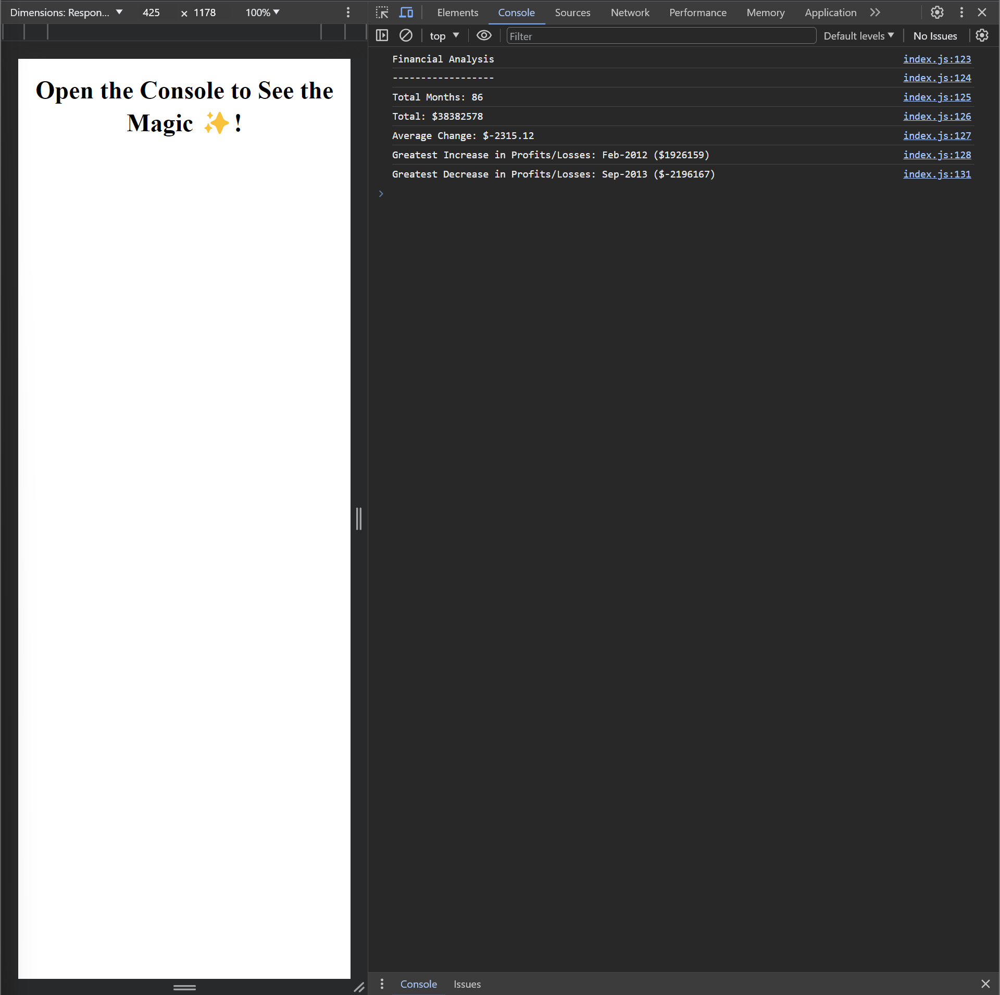

# Console-Finances

## Overview

This project involves writing JavaScript code to analyze financial records. The script calculates various metrics, including the total number of months, net total amount of Profit/Losses, average changes in Profit/Losses, and identifies the greatest increase and decrease in Profit/Losses over a given dataset.

## Installation

To run this project locally, follow these steps:

1. Clone the repository to your local machine. In bash type:

&nbsp;&nbsp;&nbsp;&nbsp;&nbsp;&nbsp;`git clone https://github.com/MrKatrish/Console-Finances`

2. Open the index.html file in your preferred web browser.

3. for example - In ChromeDevTools check console.

## Screenshots

https://mrkatrish.github.io/Console-Finances/

## Credits

Thanks to TAs and Instructors for explaining all and research on this site https://developer.mozilla.org/en-US/

## License
This project is licensed under the MIT License - see the LICENSE file for details.

## Skills used
JavaScript and HTML5
